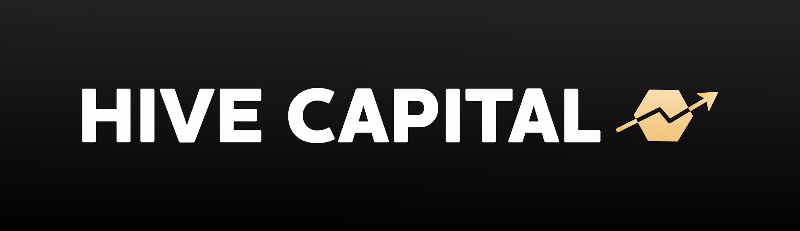

</a>

  <strong>Self governed entity autonomously investing in digital and real world assets. 🐝 🚀</strong>

  <a href="https://hivecapitaldao.gitbook.io/whitepaper/">Read our whitepaper</a>

<h3 align="center">
  <a >Contribute</a>
   · 
  <a >Community</a>
   · 
  <a >Documentation</a>
</h3>

  

## Structure

| Codebase                                     |                               Description                               |
| :------------------------------------------- | :---------------------------------------------------------------------: |
| [harthat](hardhat)                           |                        Solidity Smart Contracts                         |
| [next-app](next-app)                         |                             Next JS Client                              |
| [off-chain accounts api](next-app/pages/api) |               Api communicating to dao off chain accounts               |
| [api3]()                                     | Api3 allows the solidity smart contracts to call off-chain accounts api |
